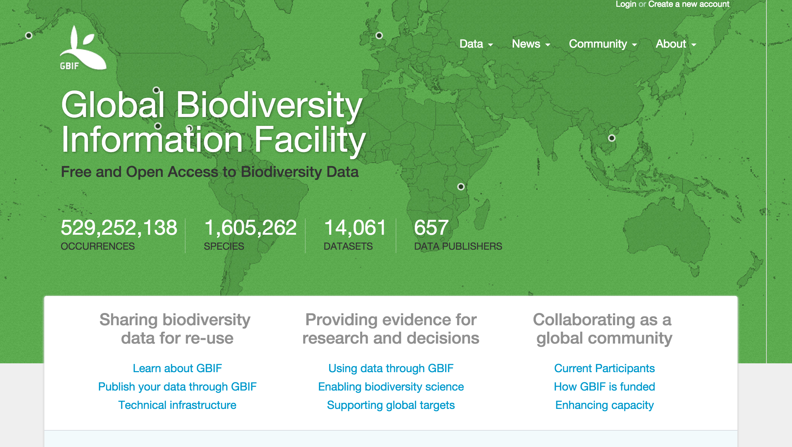

```{r, echo=FALSE}
knitr::opts_chunk$set(
	comment = "#>",
	collapse = TRUE,
	warning = FALSE,
	message = FALSE
)
```

Here's the `rgbif` screencast!

Follow along below in your favorite R client.  I'll be using the RStudio IDE.

<iframe src="//player.vimeo.com/video/127119010" width="600" height="381" frameborder="0" webkitallowfullscreen mozallowfullscreen allowfullscreen></iframe>


rgbif screencast
==========

## Intro

> Hi, I'm Scott Chamberlain

> In this screencast, I'll do a brief intoduction to the `rgbif` package - an `R` client for the Global Biodiversity Information Facility (GBIF)

> rgbif allows you to get species occurrence data from GBIF



## Installation and load

```{r eval=FALSE}
install.packages("rgbif")
```

```{r}
library("rgbif")
```

## Get number of occurrences

> Search by type of record, all observational in this case

```{r occ_count1}
occ_count(basisOfRecord = 'OBSERVATION')
```

> Records for **Puma concolor** with lat/long data (georeferenced) only. Note that `hasCoordinate` in `occ_search()` is the same as `georeferenced` in `occ_count()`.

```{r occ_count2}
occ_count(taxonKey = 2435099, georeferenced = TRUE)
```

> All georeferenced records in GBIF

```{r occ_count3}
occ_count(georeferenced = TRUE)
```

> Records from Denmark only

```{r occ_count4}
(denmark_code <- isocodes[grep("Denmark", isocodes$name), "code"])
occ_count(country = denmark_code)
```

## Search for taxonomic names

> Four taxononomic names functions

* `name_backbone()`
* `name_lookup()`
* `name_usage()`
* `name_suggest()`

> `name_backbone()` searches against the GBIF backbone taxonomy

```{r}
name_backbone(name = 'Helianthus', rank = 'genus', kingdom = 'plants')
```

> `name_lookup()` does full text search of name usages covering the scientific and vernacular name, the species description, distribution and the entire classification across all name usages of all or some checklists

```{r}
out <- name_lookup(query = 'mammalia')
```

```{r}
names(out)
```

```{r}
out$meta
```

```{r}
head(out$data, n = 2)
```

## Search for occurrences

> By default `occ_search()` returns a `dplyr` like output summary in which the data printed expands based on how much data is returned, and the size of your window. You can search in a variety of ways, including by scientific name:

```{r}
occ_search(scientificName = "Ursus americanus", limit = 20)
```

> Or to be more precise, you can search for names first, make sure you have the right name, then pass the GBIF key to the `occ_search()` function:

```{r}
key <- name_suggest(q = 'Helianthus annuus', rank = 'species')$key[1]
occ_search(taxonKey = key, limit = 20)
```

> You can choose what fields to return. This isn't passed on to the API query to GBIF as they don't allow that, but we filter out the columns before we give the data back to you.

```{r}
occ_search(scientificName = "Ursus americanus", fields = 'name', limit = 20)
```

> Most parameters are vectorized, so you can pass in more than one value:

```{r}
splist <- c('Cyanocitta stelleri', 'Junco hyemalis', 'Aix sponsa')
keys <- sapply(splist, function(x) name_suggest(x)$key[1], USE.NAMES = FALSE)
occ_search(taxonKey = keys, limit = 5)
```

## Single occurrence records

> You can also get data for specific occurrences identified by occurrence key. Data is returned as a list, with slots for metadata and data

> Just data

```{r occ_get1}
occ_get(key = 766766824, return = 'data')
```

> Just taxonomic hierarchy

```{r occ_get2}
occ_get(key = 766766824, return = 'hier')
```

> All data, or leave return parameter blank

```{r occ_get3}
occ_get(key = 766766824, return = 'all')
```

> Get many occurrences. `occ_get` is vectorized

```{r occ_get4}
occ_get(key = c(766766824, 101010, 240713150, 855998194), return = 'data')
```

## Cleaning data

> what do issues mean, can print whole table, or search for matches

```{r}
head(gbif_issues())
```

> compare out data to after occ_issues use

```{r}
(res <- occ_search(geometry = 'POLYGON((30.1 10.1, 10 20, 20 40, 40 40, 30.1 10.1))', limit = 50))
```

> Keep data only with particular issues

```{r}
res %>% occ_issues(cdround)
```

> Remove data only with certain issues

```{r}
res %>% occ_issues(-mdatunl)
```

## Other things to explore

* Maps! We have some basic mapping functionality to help you visualize data
* Registry data - there's a suite of functions to explore data providers to GBIF
* `spocc` Explore the R package `spocc`, where we integrate biodiversity data
from many places, including from GBIF via this package [spocc](https://github.com/ropensci/spocc)

## end

> That's it! Thanks for watching...
